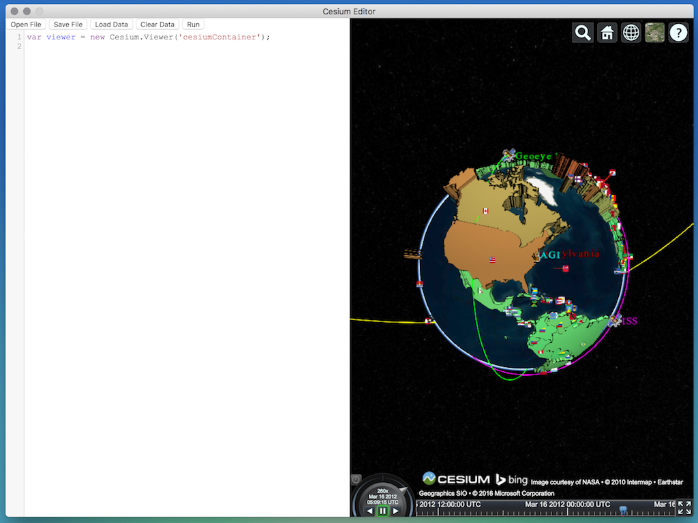

# CesiumEditor

CesiumEditor is a simple cross platform desktop app that acts as a [Cesium](http://cesiumjs.org/) editor built on [Electron](http://electron.atom.io/).

### Getting started
 * Clone the repo: `git clone git@github.com:TomPed/Cesium-Editor.git`
 * Run: `npm install`

To run the app, run: `npm run start`

### Build Guide

1. If you have made changes in `main.js`, `index.js`, or any other file/added files, run `npm run start` to see the changes.
2. When you are happy with you changes run `npm build-all` or `npm run build-mac` and `npm run build-win` in order to build the `.app` and `.exe`.
